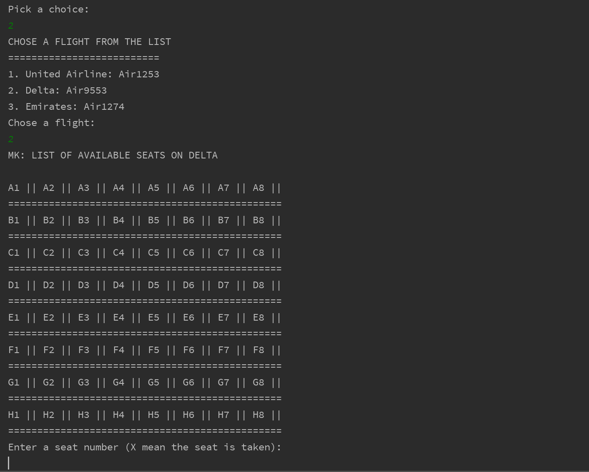

# MK: Airline
 MK Airline is a simple java application that allow user to 
 book a flight, add new flight, search for available flight, search 
 for booking detail and cancel booking etc. This application does not
 use any plugs, it is just a pale java code.
 
 #### Below is a few screen shots of the application 
 Screen shot of the main menu
 
  
  Screen shots of booking a flight
  
  
  
  Screen shots of check booking detail. As you can see below, if you 
  search by name, it will only give you few detail while when you check 
  by booking id, it give you all the detail
  
  
  
  Screen shot of printing all passengers by flight
   
  
  ### Run Detail
  JDK: require 8 and up
  
  Note: I use intellij IDEA to write this application. But you can use any 
  java IDEA.